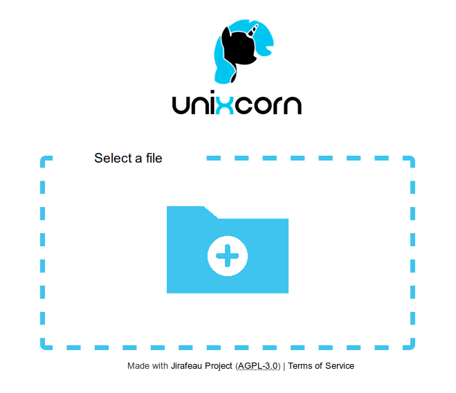

## Here is our own theme for [Jirafeau](https://gitlab.com/mojo42/Jirafeau).

It's based on the "elegantish" theme provided in the installation base, we adapted it to match our graphical charter.

### How does it looks?

### Try it!
Here is our live working instance: https://drop.unixcorn.org

## Installation
Just clone the repository in `/path/to/your/jirafeau/media/` and check the access rights match your web-server user.
